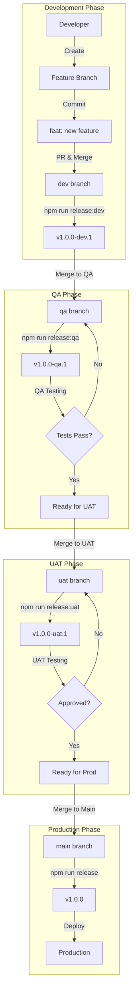
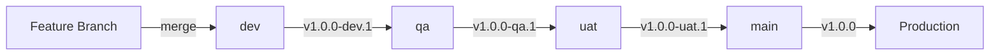
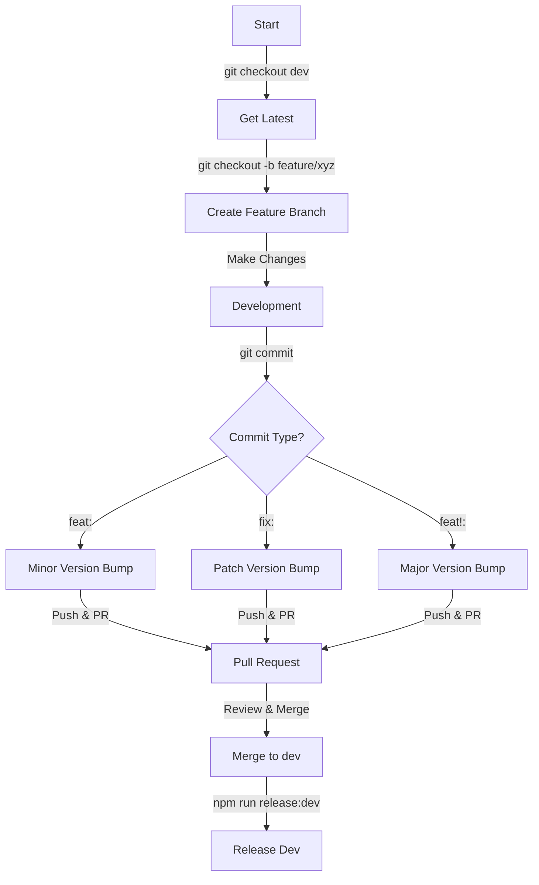
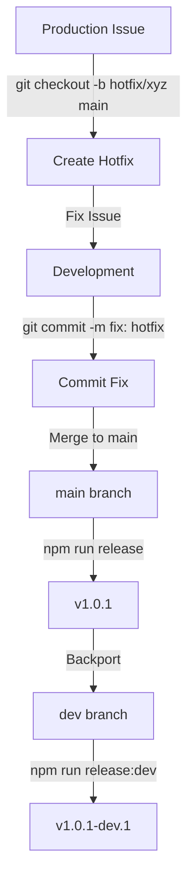
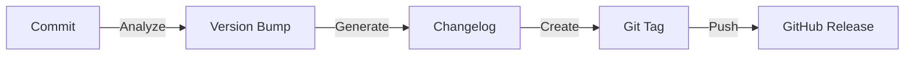
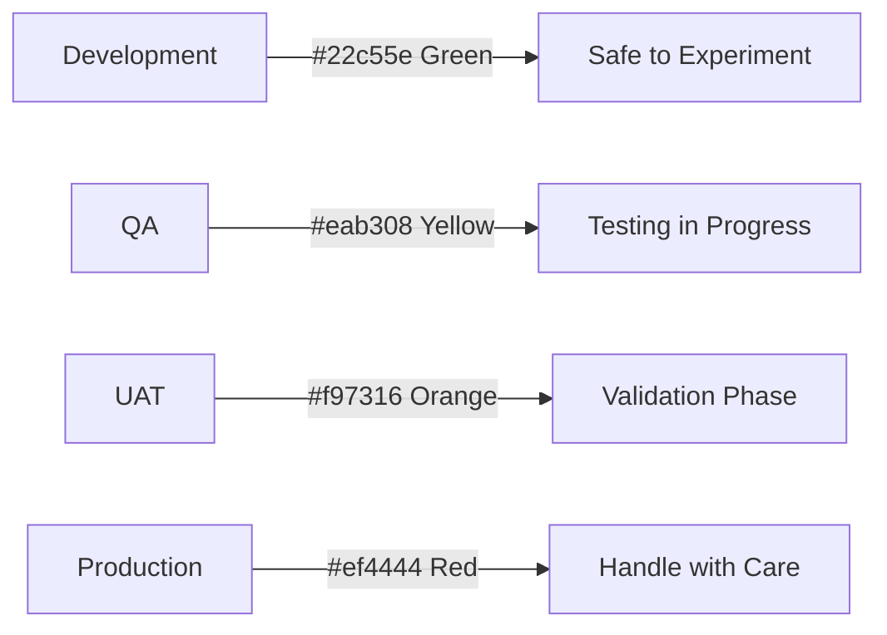

# GIB UI 🚀

A modern React-based user interface for GIB application.

## Table of Contents 📑

- [Repository Information](#repository-information-)
- [Quick Start](#quick-start-)
- [Branch Workflow and Release Process](#branch-workflow-and-release-process-)
  - [Overview](#overview-)
  - [Complete Development and Release Flow](#complete-development-and-release-flow-)
  - [Branch Strategy and Versioning](#branch-strategy-and-versioning-)
  - [Version Flow and Inheritance](#version-flow-and-inheritance-)
  - [Daily Development Workflow](#daily-development-workflow-)
  - [Hotfix Process](#hotfix-process-)
  - [Release Process](#release-process-)
    - [Release Artifacts Generation](#release-artifacts-generation-)
    - [Environment Specific Colors and Indicators](#environment-specific-colors-and-indicators-)
  - [Commit Convention](#commit-convention-)
  - [Release Commands](#release-commands-)
  - [Commit and Merge Strategy Guide](#commit-and-merge-strategy-guide-)
    - [Version Format Guide](#version-format-guide-)
    - [Commit Message Format](#commit-message-format-)
    - [Branch Merge Workflow](#branch-merge-workflow-)
    - [Hotfix Branch Commands](#hotfix-branch-commands-)
    - [Important Notes](#important-notes-)
  - [Automatic Updates](#automatic-updates-)
- [Web Access](#web-access-)
- [System Requirements](#system-requirements-)
- [Features](#features-)
- [Installation](#installation-)
- [GitHub Token Setup](#github-token-setup-)
  - [Setting up GitHub Token](#setting-up-github-token)
  - [Important Security Notes](#important-security-notes)
- [Available Scripts](#available-scripts-)
  - [Development Scripts](#development-scripts-)
  - [Build Scripts](#build-scripts-)
  - [Preview Scripts](#preview-scripts-)
  - [Release Scripts](#release-scripts-)
  - [Code Quality Scripts](#code-quality-scripts-)
  - [Utility Scripts](#utility-scripts-)
- [Development](#development-)
- [Release Configuration](#release-configuration-)
  - [Semantic Release Setup](#semantic-release-setup-)
  - [Release Process Steps](#release-process-steps-)
  - [Release Assets](#release-assets-)
- [Project Structure](#project-structure-)
- [Links and Resources](#links-and-resources)
  - [Documentation](#documentation)
  - [Project Links](#project-links)
  - [Environment URLs](#environment-urls)
  - [Support and Contact](#support-and-contact)
  - [Additional Resources](#additional-resources)

## Repository Information 📚

| Detail | Information | Link |
|:-------|:------------|:-----|
| Repository | IEVERS_UI | [GitHub Repository](https://github.com/AltafEmpaxis/IEVERS_UI) |
| Organization | Empaxis Data Management India Pvt Ltd | [Company Website](https://www.empaxis.com) |
| Latest Release | v1.0.0-dev.8 | [Latest Release](https://github.com/AltafEmpaxis/IEVERS_UI/releases/latest) |
| All Releases | GitHub Releases | [Release History](https://github.com/AltafEmpaxis/IEVERS_UI/releases) |
| Tags | Git Tags | [Tags](https://github.com/AltafEmpaxis/IEVERS_UI/tags) |
| Changelog | CHANGELOG.md | [Changelog](https://github.com/AltafEmpaxis/IEVERS_UI/blob/main/CHANGELOG.md) |
| License | MIT | [License](https://github.com/AltafEmpaxis/IEVERS_UI/blob/main/LICENSE) |
| Developer | Md Altaf Raja | [@AltafEmpaxis](https://github.com/AltafEmpaxis) |

## Quick Start 🚀

```bash
# Clone repository
git clone https://github.com/AltafEmpaxis/IEVERS_UI.git

# Navigate to project
cd IEVERS_UI

# Install dependencies
npm install

# Start development
npm run start:dev
```

## Branch Workflow and Release Process 🌿

### Overview 🔄

This project implements automated versioning and changelog generation using semantic-release. The process follows a branching strategy aligned with different environments (DEV, QA, UAT, PROD) and uses semantic versioning (MAJOR.MINOR.PATCH).

### Complete Development and Release Flow 📈



### Branch Strategy and Versioning 🏷️

| Branch | Environment | Version Format | Example | Next Version | Tag Format |
|:-------|:------------|:---------------|:---------|:-------------|:------------|
| `dev` | Development | 1.0.0-dev.x | 1.0.0-dev.1 | 1.0.0-dev.2 | v1.0.0-dev.1 |
| `qa` | QA | 1.0.0-qa.x | 1.0.0-qa.1 | 1.0.0-qa.2 | v1.0.0-qa.1 |
| `uat` | UAT | 1.0.0-uat.x | 1.0.0-uat.1 | 1.0.0-uat.2 | v1.0.0-uat.1 |
| `main` | Production | 1.0.0 | 1.0.0 | 1.0.1/1.1.0 | v1.0.0 |
| `hotfix/*` | Hotfix | 1.0.0-{id}.x | 1.0.0-fix.1 | 1.0.0-fix.2 | v1.0.0-fix.1 |

### Version Flow and Inheritance 🔄



### Daily Development Workflow 👨‍💻



### Hotfix Process 🚨



### Release Process 📦

#### Release Artifacts Generation 🛠️



#### Environment Specific Colors and Indicators 🎨



### Commit Convention 📝

| Type | Description | Version Impact |
|:-----|:------------|:---------------|
| `feat` | ✨ New features | MINOR (1.1.0) |
| `fix` | 🐛 Bug fixes | PATCH (1.0.1) |
| `BREAKING CHANGE` | 💥 Breaking changes | MAJOR (2.0.0) |
| `docs` | 📚 Documentation updates | None |
| `style` | 💅 Code style changes | None |
| `refactor` | ♻️ Code refactoring | None |
| `test` | 🧪 Adding/updating tests | None |
| `chore` | 🔧 Maintenance tasks | None |

### Release Commands ⚡

| Branch | Command | Description |
|:-------|:--------|:------------|
| `dev` | `npm run release:dev` | Create development pre-release |
| `qa` | `npm run release:qa` | Create QA release |
| `uat` | `npm run release:uat` | Create UAT release |
| `main` | `npm run release` | Create production release |
| `hotfix/*` | `npm run release` | Create hotfix release |

### Commit and Merge Strategy Guide 📋

#### Version Format Guide 📑

| Environment | Format | Example | Next Version |
|:------------|:-------|:--------|:-------------|
| Production | `v{major}.{minor}.{patch}` | v1.2.3 | v1.2.4 (patch) |
| Development | `v{major}.{minor}.{patch}-dev.{number}` | v1.2.3-dev.1 | v1.2.3-dev.2 |
| QA | `v{major}.{minor}.{patch}-qa.{number}` | v1.2.3-qa.1 | v1.2.3-qa.2 |
| UAT | `v{major}.{minor}.{patch}-uat.{number}` | v1.2.3-uat.1 | v1.2.3-uat.2 |
| Hotfix | `v{major}.{minor}.{patch}-{fix-id}.{number}` | v1.2.3-fix-123.1 | v1.2.3-fix-123.2 |

#### Commit Message Format ✍️

| Type | Format | Example | Version Impact |
|:-----|:-------|:--------|:---------------|
| Patch | `fix: message` or `fix(scope): message` | `fix(auth): handle login timeout` | v1.2.3 → v1.2.4 |
| Minor | `feat: message` or `feat(scope): message` | `feat(api): add user search` | v1.2.3 → v1.3.0 |
| Major | `feat!: message` or `BREAKING CHANGE:` | `feat!: redesign API` | v1.2.3 → v2.0.0 |

#### Branch Merge Workflow 🔄

1. **Development Branch (dev)**

   ```bash
   git checkout dev
   git pull origin dev
   # Make changes
   git commit -m "feat(scope): description"
   git push origin dev
   npm run release:dev  # Creates v1.2.3-dev.1
   ```

2. **QA Branch (qa)**

   ```bash
   git checkout qa
   git pull origin qa
   git merge --no-ff dev
   # Resolve conflicts if any
   git push origin qa
   npm run release:qa  # Creates v1.2.3-qa.1
   ```

3. **UAT Branch (uat)**

   ```bash
   git checkout uat
   git pull origin uat
   git merge --no-ff qa
   # Resolve conflicts if any
   git push origin uat
   npm run release:uat  # Creates v1.2.3-uat.1
   ```

4. **Production Branch (main)**

   ```bash
   git checkout main
   git pull origin main
   # Create PR: uat → main
   # Review and merge PR
   npm run release  # Creates v1.2.3
   ```

#### Hotfix Branch Commands 🔧

```bash
git checkout -b hotfix/bug-123 main
# Fix the issue
git commit -m "fix: critical bug fix"
git push origin hotfix/bug-123
npm run release  # Creates v1.2.3-bug-123.1
# Merge to main and backport to dev
```

#### Important Notes ⚠️

- Always use `--no-ff` flag for merges to maintain branch history
- Resolve conflicts carefully to maintain correct versioning
- Run tests after merges to ensure stability
- Create PR for main branch merges for better control
- Version bumps are automatic based on commit messages

### Automatic Updates 🤖

| Process | Description |
|:--------|:------------|
| 🔄 Version Control | Determines version based on commits |
| 📝 Documentation | Updates changelog automatically |
| 🏷️ Release Management | Creates GitHub release |
| 🚀 Deployment | Deploys to appropriate environment |

## Web Access 🌐

| Environment | URL | Purpose | Status | Branch |
|:------------|:----|:--------|:-------|:-------|
| Development | [Dev Portal](https://dev-ievers.vercel.app) | Development Testing | 🟢 Active | `dev` |
| QA | [QA Portal](https://qa-ievers.vercel.app) | Quality Assurance | 🟢 Active | `qa` |
| UAT | [UAT Portal](https://uat-ievers.vercel.app) | User Acceptance | 🟢 Active | `uat` |
| Production | [Production Portal](https://ievers.vercel.app) / [Portal](http://portal.empaxis.com:7041) | Live System | 🟢 Active | `main` |

## System Requirements 💻

| Requirement | Version | Notes |
|:------------|:--------|:------|
| Node.js | 18+ | LTS version recommended |
| npm | 9+ | Comes with Node.js |
| Memory | 8GB+ | For optimal performance |
| Storage | 1GB+ | For project files |

## Features ✨

- Material-UI based components
- Semantic Release integration
- Multi-environment support (DEV, QA, UAT, PROD)
- Automated versioning and changelog generation
- Enhanced User Experience
  - Responsive design for all devices
  - Dark/Light theme support
  - Customizable UI components
  - Real-time data updates
  - Advanced caching strategies
  - Optimized performance

## Installation 📥

```bash
npm install
```

## GitHub Token Setup 🔑

### Setting up GitHub Token

1. **Generate Token**:
   - Go to GitHub → Settings → Developer settings → Personal access tokens → Tokens (classic)
   - Generate new token with required permissions (repo, workflow)
   - Copy the generated token

> **Note**: `GH_TOKEN` and `GITHUB_TOKEN` are interchangeable environment variables. Both are recognized by GitHub Actions and other GitHub-related tools. You can use either one, but `GITHUB_TOKEN` is more commonly used and more explicit.

2. **Set Token in PowerShell (Temporary - Current Session)**:
```powershell
# Using GITHUB_TOKEN (recommended)
$env:GITHUB_TOKEN = "your-github-token-here"
# Example: $env:GITHUB_TOKEN = "ghp_xxxxxxxxxxxxxxxxxxxx"

# OR using GH_TOKEN (alternative)
$env:GH_TOKEN = "your-github-token-here"
# Example: $env:GH_TOKEN = "ghp_xxxxxxxxxxxxxxxxxxxx"
```

3. **Set Token in Windows (Permanent)**:
```powershell
# Using GITHUB_TOKEN (recommended)
[System.Environment]::SetEnvironmentVariable('GITHUB_TOKEN', 'your-github-token-here', 'User')
# Example: [System.Environment]::SetEnvironmentVariable('GITHUB_TOKEN', 'ghp_xxxxxxxxxxxxxxxxxxxx', 'User')

# OR using GH_TOKEN (alternative)
[System.Environment]::SetEnvironmentVariable('GH_TOKEN', 'your-github-token-here', 'User')
# Example: [System.Environment]::SetEnvironmentVariable('GH_TOKEN', 'ghp_xxxxxxxxxxxxxxxxxxxx', 'User')
```

4. **Verify Token Setup**:
```powershell
# Method 1: Check current session
$env:GITHUB_TOKEN
# OR
$env:GH_TOKEN

# Method 2: Check using .NET method
[System.Environment]::GetEnvironmentVariable('GITHUB_TOKEN')
# OR
[System.Environment]::GetEnvironmentVariable('GH_TOKEN')

# Method 3: Check using Get-ChildItem
Get-ChildItem env:GITHUB_TOKEN
# OR
Get-ChildItem env:GH_TOKEN
```

### Troubleshooting Token Issues 🔧

If you encounter token-related errors (e.g., "No GitHub token specified"), follow these steps:

1. **Verify Token Permissions**:
   - Required permissions:
     - `repo` (full control)
     - `workflow`
     - `admin:repo_hook`

2. **Set Token in Fresh PowerShell Session**:
```powershell
# 1. Close all PowerShell windows
# 2. Open new PowerShell
# 3. Navigate to project
cd "your-project-path"

# 4. Set both tokens
$env:GITHUB_TOKEN = "your-token-here"
$env:GH_TOKEN = $env:GITHUB_TOKEN

# 5. Verify setup
Write-Host "GITHUB_TOKEN: $env:GITHUB_TOKEN"
Write-Host "GH_TOKEN: $env:GH_TOKEN"

# 6. Run your command
npm run release:dry-run
```

3. **Common Issues and Solutions**:
   - Token not visible in current session → Set both `GITHUB_TOKEN` and `GH_TOKEN`
   - Token not persisting → Use User level environment variable
   - Semantic Release errors → Ensure token has correct permissions
   - Command fails → Try in new PowerShell session

4. **Best Practices**:
   - Always set both `GITHUB_TOKEN` and `GH_TOKEN` for compatibility
   - Use a fresh PowerShell session when troubleshooting
   - Verify token format starts with `ghp_`
   - Check for extra spaces or characters in token
   - Keep token permissions up to date

### Important Security Notes ⚠️
- Never commit tokens to version control
- Keep tokens secure and private
- Rotate tokens periodically
- Use environment-specific tokens
- Set appropriate token permissions
- Token format example: `ghp_xxxxxxxxxxxxxxxxxxxx`

## Available Scripts 🛠️

### Development Scripts 🔧

| Command | Description | Environment |
|:--------|:------------|:------------|
| `npm run start` | Start development server | Default |
| `npm run start:dev` | Start development server | Development |
| `npm run start:qa` | Start development server | QA |
| `npm run start:uat` | Start development server | UAT |
| `npm run start:prod` | Start development server | Production |

### Build Scripts 🏗️

| Command | Description | Environment |
|:--------|:------------|:------------|
| `npm run build` | Build application | Default |
| `npm run build:dev` | Build application | Development |
| `npm run build:qa` | Build application | QA |
| `npm run build:uat` | Build application | UAT |
| `npm run build:prod` | Build application | Production |

### Preview Scripts 👀

| Command | Description | Environment |
|:--------|:------------|:------------|
| `npm run preview` | Preview build | Default |
| `npm run preview:dev` | Preview build | Development |
| `npm run preview:qa` | Preview build | QA |
| `npm run preview:uat` | Preview build | UAT |
| `npm run preview:prod` | Preview build | Production |

### Release Scripts 🚀

| Command | Description | Branch |
|:--------|:------------|:-------|
| `npm run release` | Create production release | main |
| `npm run release:dev` | Create development release | dev |
| `npm run release:qa` | Create QA release | qa |
| `npm run release:uat` | Create UAT release | uat |
| `npm run release:prod` | Create production release | main |
| `npm run release:dry-run` | Test release process | - |
| `npm run release:ci` | CI/CD release | - |

### Code Quality Scripts ✨

| Command | Description |
|:--------|:------------|
| `npm run lint` | Check code style issues |
| `npm run lint:fix` | Fix code style issues |
| `npm run prettier` | Format code with Prettier |
| `npm run format` | Run linting and formatting |

### Utility Scripts 🔧

| Command | Description |
|:--------|:------------|
| `npm run clear` | Clean project (remove node_modules, cache, etc.) |
| `npm run version:check` | Check package version |
| `npm run changelog:preview` | Preview changelog |
| `npm run changelog:verify` | Verify changelog configuration |
| `npm run ci:verify` | Verify CI configuration |
| `npm run ci:dry-run` | Test CI process |

## Development 👨‍💻

```bash
# Start development server
npm run start:dev

# Build for production
npm run build:prod
```

## Release Configuration ⚙️

### Semantic Release Setup 🔄

| Component | Description |
|:----------|:------------|
| Tag Format | `v${version}` (e.g., v1.0.0, v1.0.0-dev.1) |
| Assets | package.json, CHANGELOG.md, README.md, docs |
| Plugins | commit-analyzer, release-notes, changelog, npm, git, github |

### Release Process Steps 📋

1. **Commit Analysis**
   - Analyzes conventional commit messages
   - Determines version bump type
   - Decides if release is needed

2. **Release Notes**
   - Generates changelog content
   - Groups commits by type
   - Creates formatted release notes

3. **Version Management**
   - Updates CHANGELOG.md
   - Updates package.json version
   - Creates git tags

4. **GitHub Release**
  - Creates GitHub release
   - Publishes release notes
   - Attaches build artifacts

### Release Assets 📦

| Asset | Purpose |
|:------|:--------|
| package.json | Version and dependencies |
| CHANGELOG.md | Release history |
| README.md | Project documentation |
| build/my-build.zip | Production build package |

## Project Structure 📂

```bash
IEVERS_UI/
├── .github/                    # GitHub configuration files
│   └── workflows/             # GitHub Actions workflow files
├── .vscode/                   # VS Code configuration
│   ├── launch.json           # Debug launch configurations
│   └── tasks.json           # VS Code tasks
├── node_modules/             # Project dependencies
├── src/                      # Source code
│   ├── assets/              # Static assets
│   ├── components/          # Reusable components
│   ├── config/              # App configuration
│   ├── contexts/            # React contexts
│   ├── hooks/              # Custom React hooks
│   ├── layout/             # Layout components
│   ├── lib/                # Library code
│   ├── menu-items/         # Navigation menu items
│   ├── pages/              # Page components
│   ├── routes/             # Route definitions
│   ├── store/              # State management
│   ├── styles/             # Global styles
│   ├── themes/             # Theme configuration
│   ├── utils/              # Utility functions
│   ├── App.jsx            # Root App component
│   ├── config.js          # Global configuration
│   ├── index.jsx          # Application entry point
│   ├── reportWebVitals.js # Performance reporting
│   └── vite-env.d.js      # Vite environment types
├── .editorconfig           # Editor configuration
├── .env.development        # Development environment variables
├── .env.production         # Production environment variables
├── .env.qa                # QA environment variables
├── .env.uat               # UAT environment variables
├── .eslintignore          # ESLint ignore patterns
├── .eslintrc              # ESLint configuration
├── .gitignore             # Git ignore patterns
├── .npmignore             # npm ignore patterns
├── .prettierignore        # Prettier ignore patterns
├── .prettierrc            # Prettier configuration
├── CHANGELOG.md           # Release changelog
├── LICENSE               # Project license
├── README.md             # Project documentation
├── favicon.ico           # Project favicon
├── index.html            # HTML entry point
├── jsconfig.json         # JavaScript configuration
├── jsconfig.node.json    # Node.js configuration
├── package-lock.json     # Package lock file
├── package.json          # Project dependencies and scripts
├── release.config.mjs    # Semantic release configuration
├── vercel.json          # Vercel deployment configuration
├── vite.config.mjs       # Vite configuration
└── web.config           # IIS configuration
```

## Links and Resources

### Documentation

| Resource | URL | Description |
|:---------|:----|:------------|
| API Documentation | [Swagger UI](http://portal.empaxis.com:7041/swagger/index.html) | REST API documentation and testing |
| Conventional Commits | [Guide](https://www.conventionalcommits.org/) | Commit message convention guide |
| Commit Cheatsheet | [Cheatsheet](https://cheatsheets.zip/conventional-commits.html) | Quick reference for commit formats |
| React Documentation | [React Docs](https://react.dev) | Official React documentation |
| Vite Documentation | [Vite Docs](https://vitejs.dev) | Official Vite documentation |
| Semantic Release | [semantic-release](https://semantic-release.gitbook.io) | Automated versioning guide |

### Project Links

| Resource | URL |
|:---------|:----|
| Repository | [GitHub](https://github.com/AltafEmpaxis/IEVERS_UI) |
| Issues | [GitHub Issues](https://github.com/AltafEmpaxis/IEVERS_UI/issues) |
| Pull Requests | [GitHub PRs](https://github.com/AltafEmpaxis/IEVERS_UI/pulls) |
| Releases | [GitHub Releases](https://github.com/AltafEmpaxis/IEVERS_UI/releases) |

### Environment URLs

| Environment | URL | Purpose |
|:------------|:----|:--------|
| Development | [https://dev-ievers.vercel.app](https://dev-ievers.vercel.app) | Development testing |
| QA | [https://qa-ievers.vercel.app](https://qa-ievers.vercel.app) | Quality assurance |
| UAT | [https://uat-ievers.vercel.app](https://uat-ievers.vercel.app) | User acceptance testing |
| Production | [https://ievers.vercel.app](https://ievers.vercel.app) | Live production |

### Support and Contact

| Contact | Details |
|:--------|:--------|
| Technical Support | [support@empaxis.com](mailto:support@empaxis.com) |
| Developer Contact | [altaf.raja@empaxis.com](mailto:altaf.raja@empaxis.com) |
| Company Website | [Empaxis](https://www.empaxis.com) |

### Additional Resources

| Resource | URL | Description |
|:---------|:----|:------------|
| Material-UI Docs | [MUI](https://mui.com/) | UI component library |
| React Query Docs | [TanStack Query](https://tanstack.com/query/latest) | Data fetching library |
| Vite Guide | [Vite](https://vitejs.dev/) | Build tool documentation |
| React Router | [Documentation](https://reactrouter.com/) | Routing library |
